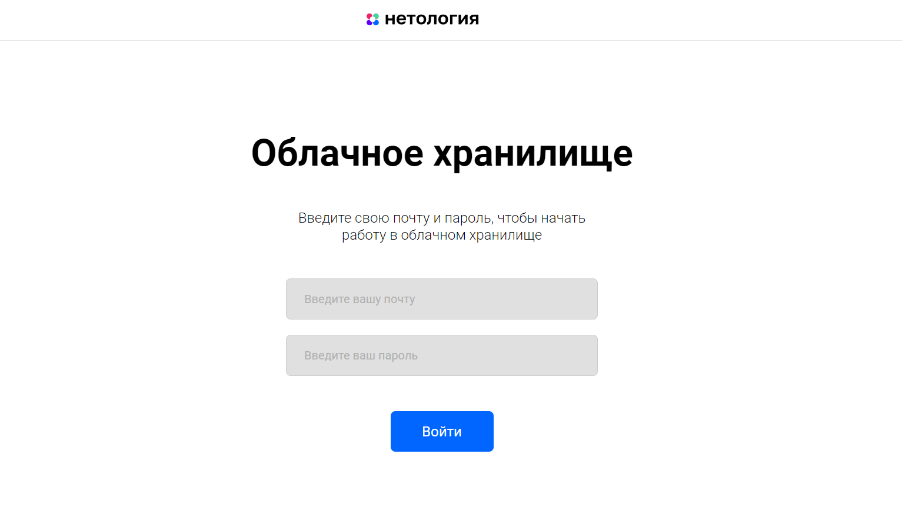
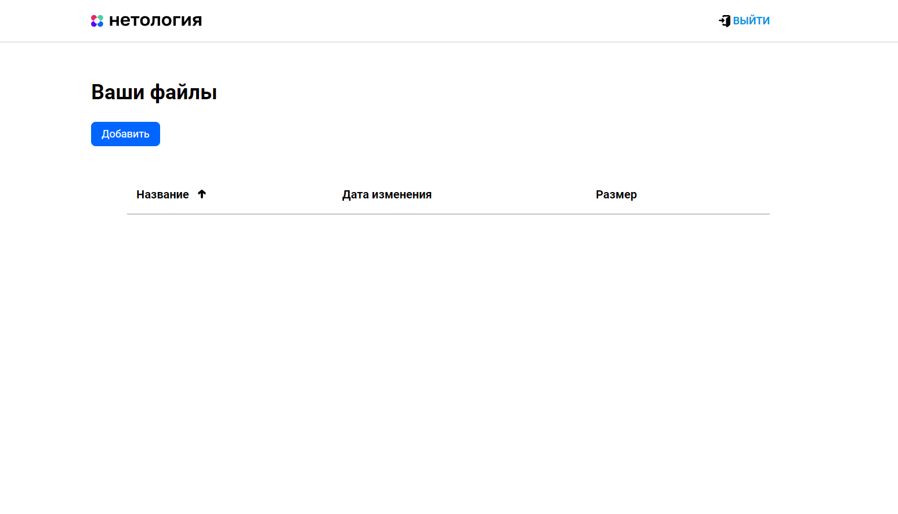
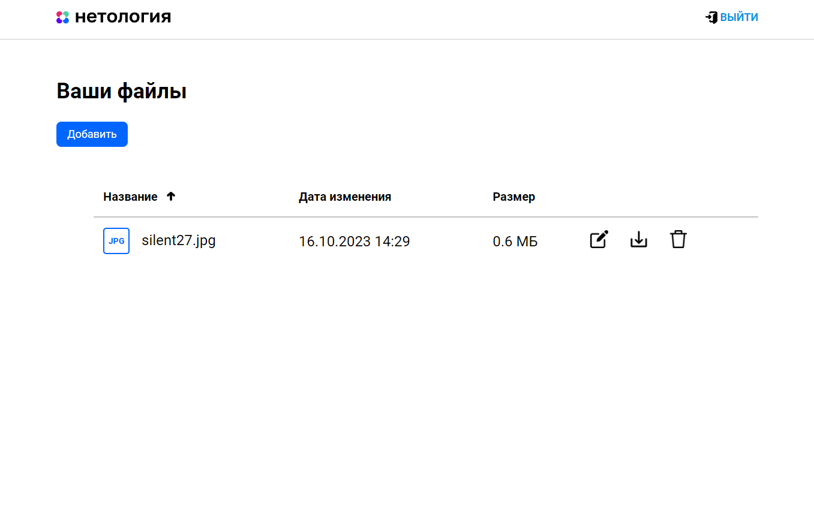

# CloudServiceApplication
# Приложение “Облачное хранилище”

[**Требования**](https://github.com/netology-code/jd-homeworks/blob/master/diploma/cloudservice.md)

## Реализация
- Приложение разработано с использованием Spring Boot
- Использован сборщик пакетов Maven
- Для запуска используется Docker, Docker-Compose
- База данных - PostgreSQL
- Тесты:
- Unit тесты с использованием Mockito
- Интеграционные тесты с использованием testcontainers

## Приложение позволят пользователям работать с файлами, а именно
- загружать файлы
- получать файлы по имени
- переименовывать файлы
- удалять файлы
- просматривать список файлов

## Порты
- Frontend - 8080
- Backend - 8099
- PostgreSQL - 5432

## Пользователи:
- login: silent27, password: sIleNt27;
- login: eva, password: eVa.

## Результат

